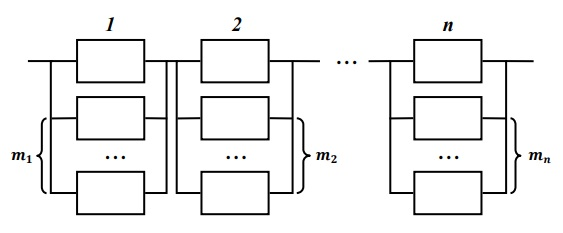

# The problem of optimal redundancy

This research is intended to solve problem of optimal redundancy for 
Renewal Theory systems with multiple limitations.

## About research

Object of research: sequential connection of _n_ independent reservation areas, 
and each of these areas (or _subsystems_) has its own amount of reserve elements 
(_m1_,_m2_,...,_mn_) for reliability 
improvement. The number of reserve elements is restricted by one or more 
limitations.

Program researches _inverse problem_ of optimal redundancy using 
_unloaded reservation_ (cold reserve), which means that broken main element is 
immediately replaced with a new one from the set of reserve elements.

Elements of subsystems and subsystems themselves have their own reliability -
time while they can work without failure. In case of sequential connection, if
main element in one of subsystems brakes down and this subsystem does not have
serviceable reserve element - the whole system also brakes down.
Also system can optionally have recovery block - a unit where broken elements 
may recover and be returned to their subsystems as reserve elements.

**Main goal**: find optimal set of reserve elements to maximize system reliability.

## How to use program

Page with program is available via [this link](https://vladgalafm.github.io/OptimalRedundancy/en/).

To get solution for your task, you should:

1. Choose amount of subsystems (from 1 to 15) and limitations (up to 4)
2. Fill coefficients of failure intensity (_&lambda;_) for each subsystem. Only 
positive values are allowed.
3. Fill restriction coefficients for all limitations. You can choose only
positive integer values.
4. Select time _T_ and iterations amount of system simulation via imitation 
modeling algorithm.
5. You can also activate elements recovery for you system - just check recovery 
intensity (_&mu;_) and fill it's value. As well as for _&lambda;_, only positive 
values are allowed.
6. Click submit button at the bottom of the page and wait for a while - solution 
will be founded soon. If you have too many subsystems in combination with big 
limitation coefficients and limitations amount, you will see warning about 
program restrictions. Please, do not ignore this message.

Once you get your solution, you can collapse results and rerun program with 
other settings.